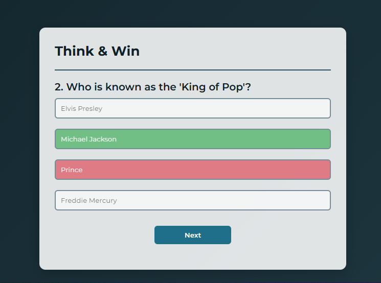
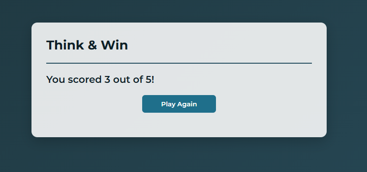

# 🎯 クイズアプリ

HTML・CSS・Vanilla JavaScript で作成した、楽しく遊べるインタラクティブなクイズアプリです。

---

## 学んだこと

このプロジェクトは、JavaScript のロジックや DOM 操作のスキルを向上させるために作成しました。制作を通して、以下のことを学びました。

* JavaScript で複数選択式の問題を作成・構造化する方法
* ボタンを動的に生成して DOM に追加する方法
* **dataset 属性** を使って正解を判定する方法
* クリックイベントで即時フィードバックを表示する方法
* 回答後に選択肢を無効化し、正解を強調表示する方法
* 問題、スコア、クイズの状態管理方法
* 各問題ごとに UI を動的に更新する方法

---

## 主な機能

* 即時フィードバック付きの複数選択クイズ
* 正解は緑色、不正解は赤色で表示
* 回答後はすべてのボタンを無効化
* 「次へ」ボタンで次の問題へ移動
* 最終スコアを表示し、**もう一度プレイ**できる
* PC・スマホ両方に対応したレスポンシブデザイン

---

## フォルダ構成

```
Quiz-App/
├── index.html                 
├── css/
│   └── style.css            
├── js/
│   └── script.js                   
```

---

## 動作の仕組み

* クイズの問題は JavaScript の配列オブジェクトとして管理します。
* 各問題は 4 つの選択肢ボタンとともに動的に表示されます。
* 回答をクリックすると、正解か不正解かが即座に表示されます。
* 回答後はすべての選択肢が無効化され、正解は強調表示されます。
* 「次へ」ボタンで次の問題に進み、全問終了後にスコアを表示します。
* スコア画面から再度クイズをプレイできます。

---

## Live Demo

[🔗 View Demo](https://quizapp1630.netlify.app)

---

## 今後の改善予定

* 各問題に制限時間（カウントダウンタイマー）を追加
* スポーツ、音楽、映画、食べ物、一般常識などのジャンルを追加
* API からクイズデータを取得して問題をランダム化
* 正解・不正解の詳細な結果表示
* 正解・不正解時の効果音追加

---

## 作者

アマン・ライ (Aman Rai)  
JavaScript を学習中の初心者 Web 開発者  
現在 日本・東京 在住  
使用言語: 英語、ヒンディー語、ネパール語、日本語（N3）


---

## プレビュー





---