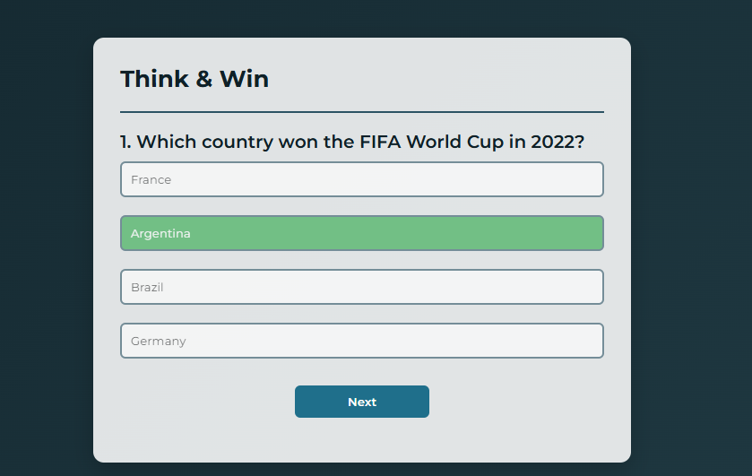

Available in: [🇯🇵 日本語はこちら](README.ja.md)

# 🎯 Quiz App

A fun and interactive quiz web app built using **HTML**, **CSS**, and **Vanilla JavaScript**.

---

## What I Learned

This project was part of my hands-on practice to improve my JavaScript logic and DOM manipulation skills. Through building this app, I learned:

* How to create and structure multiple-choice questions in JavaScript
* Dynamically generating buttons and inserting them into the DOM
* Using **dataset attributes** to store and check correct answers
* Handling **click events** to provide instant feedback
* Disabling options after selection and highlighting the correct answer
* Managing state for questions, scores, and quiz reset
* Updating the interface dynamically for each new question

---

## Features

* Multiple-choice questions with instant feedback
* Correct answers highlighted in green, incorrect in red
* Disables all answers after one is chosen
* “Next” button to move to the following question
* Displays the final score with a **Play Again** option
* Responsive design for both desktop and mobile

---

## Folder Structure

```
Quiz-App/
├── index.html                 
├── css/
│   └── style.css            
├── js/
│   └── script.js               
```

---

## How It Works

* The quiz questions are stored in a JavaScript array of objects.
* Each question displays with four answer buttons **generated** dynamically.
* Clicking an answer shows if it’s correct or incorrect immediately.
* All buttons are disabled after selection, with the correct one highlighted.
* Clicking **Next** loads the next question until all are completed.
* The final score is displayed with an option to restart the quiz.

---

## Future Plans

* Add a countdown timer for each question
* Add more topics like Sports, Music, Movies, Food, and GK
* Fetch quiz data from an API for variety
* Show a summary of correct/incorrect answers at the end
* Add sound effects for right and wrong answers

---

## Author

**Aman Rai**
Beginner Web Developer learning JavaScript
Currently living in **Tokyo, Japan**
Languages: English, Hindi, Nepali, Japanese (N3)

---

## Preview


(images/screenshot2.png)
(images/screenshot3.png)

